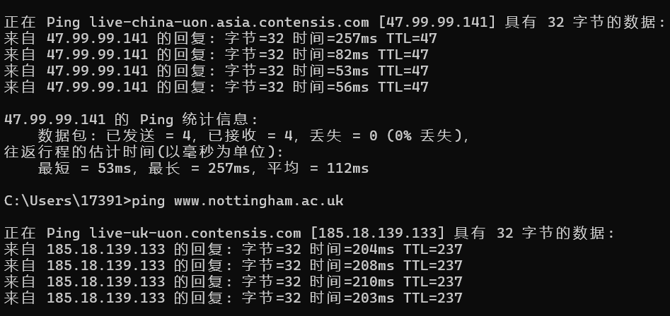
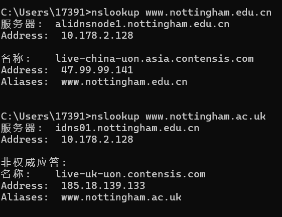
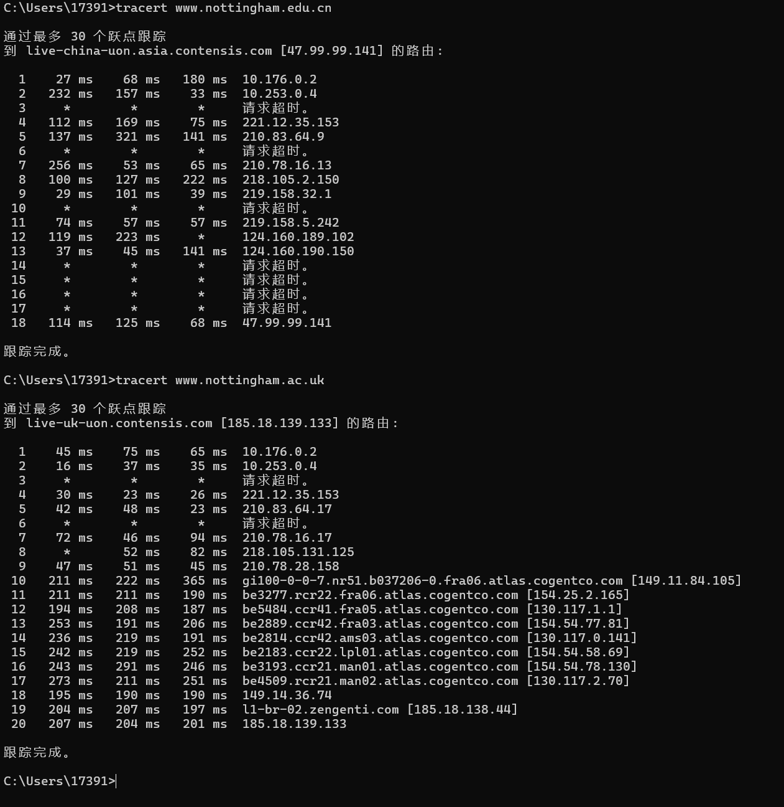

    

# Xiaoyan Gong 

    

# 20617151

# COMP1048

# Databases and Interfaces

# Lab 001

# 23/9/2024

## Section 2.3.1  

1. the latency for the host nottingham.edu.cn is 112ms average and 257ms maximum.

2. the latency for the host nottingham.ac.uk is 206ms average and 210ms maximum.

3. since the physical location of the host nottingham.edu.cn is in the same country with me, the latency is lower.

## Section 2.3.2  

1. the IP address of the host nottingham.edu.cn is 47.99.99.141  

2. the IP address of the host nottingham.ac.uk is 185.18.139.133

3. they are different server so the IP address is different.

## Section 2.3.3  

1. it needs 18 hops to reach the host nottingham.edu.cn

2. it needs 20 hops to reach the host nottingham.ac.uk

